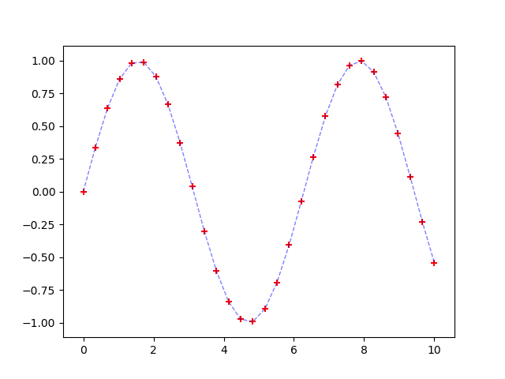

:stem: latexmath
= Getting started with Numerical Analysis

This tutorials aims at beginning with numerical analysis tootls. First, a very quick summary about notations and time-discretisation is given. Then, an introduction to python's matplotlib is given in order to start working with our soon-to-be mastered knowledge.

== Notation

It can be tricky to correctly refer to different concepts. Consequently, a notation is introduced in order to clarify everything right from the beginning.

=== Uppercase

The Uppercase notation will be used in order to refer to exact solutions. Hence, when we try to solve such problem :

[stem] 
++++ 
Y'(t) = f(t,Y(t), Y'(t))
++++

On may take for granted that stem:[Y(t)] referts to the exact solution of the problem.

=== Lowercase

On the other hand, a lower case notation refers to a numerical solution to the same problem. Thus, stem:[y(t)] is an approximation of stem:[Y(t)] using a numerical method. Since the approximation is not prefect :
[stem] 
++++ 
Y(t) \neq y(t)
++++

Of course, there are exceptions to this notation :

* stem:[t] is used as the main variable
* stem:[f] is employed genreally as a reference to a function

=== Underscores

Evaluation a function at a specific time can quickly induce a hard-to-read notation. Thus, we introduce such notation :

[stem] 
++++ 
Y(t_{\alpha}) = Y_{\alpha}
++++

This notation is employed for both exact and numerical approximations :

[stem] 
++++ 
y(t_{\alpha}) = y_{\alpha}
++++

== Time discretization

When solving ODEs using numerical methods, the solution is not necessarily known at every value of stem:[t] but at very specific ones. It is a conseuqence of the numerical schemes. Thus, the continuous variable stem:[t] is discretised in stem:[N] time-steps. For most cases, the time-step, which refers to the gap between two discretised instants, is constant. It is a parameter of the numerical scheme.
For instance, if a time-step of value stem:[h] is used, one knows that :

[stem] 
++++ 
t_{n+1} = t_n + h
++++

However, a consequence of such choice is that stem:[t_{\alpha}] using time-step stem:[h_1] is not the same as stem:[t_{\alpha}] using time-step stem:[h_2] (as long as stem:[h_1 \neq h_2] of course!)

The next figures exhibits the difference between a continuous function and its discretised version. Here, the continous sine function is represented in blue, whereas its discretised counterpart is shown using red crosses.

== Exercices

The set of exercices aims at mastering plotting graphs using matplotlib. If you are already knowledgeable on this topic, feel free to move to the next section! Here, some previous programming experience is expected, for instance on matlab, python or java.

In order to use python, one must first install a distribution of python beforehand with the matplotlib package. It is possible to use virtual machines given by your school (Citrix) or simply install the software on your machine. A package of https://www.spyder-ide.org/[Spyder] is highly recommended, as most of you are probably used to Matlab and its interface. Yet, one lay use whatever one feels like.

=== Problem 1 : Introduction to Numpy

Here, we focus on a little introduction of numpy, a linear algebra module for python. On could rewrite everything, but there is a https://numpy.org/doc/stable/user/absolute_beginners.html[guidebook] within the package that explains most parts.

=== Problem 2 : Introduction to Matplotlib

It is not a problem in itself, but since python and Matplotlib really are a you-learn-it-while-playing-with-it, i'd recommend trying to reproduce everything on this https://matplotlib.org/cheatsheets/handout-beginner.pdf[PDF] as it is a reminder of all the main functionnalities of matplotlib, the usual package used in order to produce graphs.
